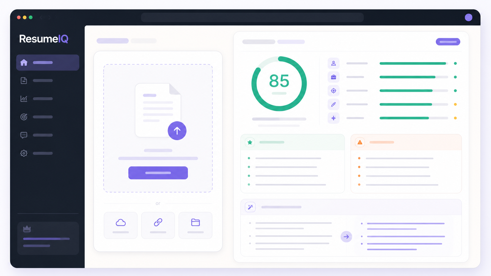

# ResumeIQ

### A structured second opinion for your résumé.

[**Open the live reviewer →**](https://resume-iq-eta-bay.vercel.app)

> [!NOTE]
> The image below is a project-specific concept illustration. The live ResumeIQ interface was verified, but automated browser capture repeatedly timed out, so this is intentionally not presented as a screenshot.

---

## What the report answers

ResumeIQ turns a résumé PDF—or pasted résumé text—into a consistent review rather than a loose chat response.

| Signal | What the candidate receives |
|---|---|
| **Overall score** | a quick orientation, not a hiring verdict |
| **Category review** | structured feedback across the résumé’s major dimensions |
| **Strengths** | evidence worth preserving |
| **Weaknesses** | specific areas that reduce clarity or impact |
| **Bullet rewrites** | three examples of stronger, outcome-led writing |

The product is deliberately narrow: upload, extract, review, understand, revise.

## Evidence path

~~~mermaid
flowchart LR
    PDF[Resume PDF] --> EXTRACT[PDF.js text extraction]
    TEXT[Pasted text] --> VALIDATE[Client validation]
    EXTRACT --> VALIDATE
    VALIDATE --> API[Vercel /api/review]
    API --> PROMPT[System instructions and response schema]
    PROMPT --> MODEL[Gemini review]
    MODEL --> JSON[Structured JSON]
    JSON --> RESULT[Scored result view]

    classDef private fill:#ede8ff,stroke:#7259d9,color:#241d35
    class PDF,EXTRACT,TEXT,VALIDATE private
~~~

### Privacy boundary

PDF parsing happens in the browser. The client sends extracted text—not the original PDF—to the serverless function. The current flow processes the text in memory and does not add application-level persistence.

That is a useful boundary, but it is not a promise that external infrastructure or the AI provider retains nothing. Review provider terms, deployment logs, and organisational data policy before handling sensitive résumés.

## Review contract

~~~mermaid
sequenceDiagram
    actor C as Candidate
    participant B as Browser
    participant F as Serverless function
    participant G as Gemini
    participant R as Result view

    C->>B: Drop PDF or paste text
    B->>B: Extract and validate resume text
    B->>F: POST review request
    F->>F: Apply system instructions and schema
    F->>G: Request structured analysis
    G-->>F: Schema-conforming response
    F-->>B: Clean review JSON
    B->>R: Render score and guidance
    R-->>C: Candidate reviews and revises
~~~

## Interface states

The frontend is a small, explicit state machine:

~~~text
idle → validating → reviewing → result
  ↘ error ←───────────────↗
~~~

- **UploadZone** handles drag-and-drop and text entry.
- **LoadingState** keeps long-running AI work legible.
- **ResultView** turns the response schema into score, category, strength, weakness, and rewrite surfaces.
- Shared types keep the UI aligned with the expected server response.

## Repository anatomy

~~~text
ResumeIQ/
├── api/
│   └── review.ts            Vercel function and AI review contract
├── src/
│   ├── App.tsx              Product state machine
│   ├── components/
│   │   ├── UploadZone.tsx
│   │   ├── LoadingState.tsx
│   │   └── ResultView.tsx
│   └── lib/
│       ├── pdfExtract.ts    Browser-side PDF text extraction
│       └── types.ts         Structured result types
├── vercel.json              SPA and function delivery
└── resumeiq-concept.png     Clearly illustrative README visual
~~~

## Run a review locally

### Requirements

- Node.js 18+
- npm
- a Gemini API key
- Vercel CLI for the full frontend + function workflow

~~~bash
git clone https://github.com/QizarBilal/ResumeIQ.git
cd ResumeIQ
npm install
cp .env.example .env
~~~

Set **GEMINI_API_KEY** in the local environment file, then run:

~~~bash
vercel dev
~~~

Open **http://localhost:3000**.

For UI-only development:

~~~bash
npm run dev
~~~

The Vite server can render the interface, but the review action requires the serverless function.

## Ship safely

1. Import the repository into Vercel.
2. Add **GEMINI_API_KEY** as a protected environment variable.
3. Never expose the provider key through a VITE-prefixed variable.
4. Confirm request-size and character limits in both the client and function.
5. Review model name, response schema, and provider pricing before production use.
6. Avoid logging raw résumé content.
7. Add abuse controls before exposing the API at scale.

## Evaluation cautions

ResumeIQ is writing assistance—not an applicant-tracking system, recruiter, or employment decision tool. Scores are model-generated and may be inconsistent or biased. Do not use the output as the sole basis for hiring, rejection, compensation, or other consequential decisions.

Candidates should verify every rewrite. The strongest résumé remains truthful, specific, and grounded in work they actually performed.

## Adapt the rubric

| Goal | Source |
|---|---|
| Change review strictness | api/review.ts system instructions |
| Add or remove result fields | api/review.ts response schema and src/lib/types.ts |
| Change upload constraints | UploadZone and the review function |
| Restyle the product | src/index.css |
| Change the model | api/review.ts provider configuration |

## Maintainer and license

Built by **Mohammed Qizar Bilal** and released under the [MIT License](LICENSE).

[Live app](https://resume-iq-eta-bay.vercel.app) · [GitHub](https://github.com/QizarBilal) · [Portfolio](https://qizar-bilal.vercel.app)

---

A score is a prompt to inspect—not a verdict.

